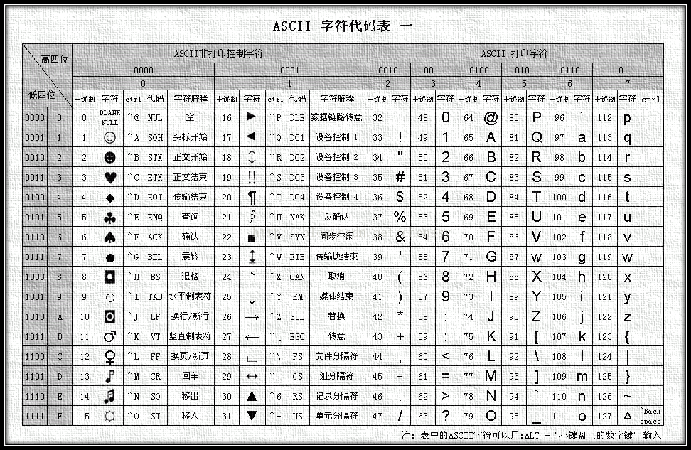

# Day1 顺序结构

## 程序的基本结构
每一个C++程序都遵循着一个固定的结构，也许我们可以叫他【模板】。如同学习一门语言（如英语、日语等），在还不能完全理解的阶段，最好可以将其背诵下来，而不是去深究每句话的具体含义。
```c++
#include<cstdio>
using namespace std;
int main(){
    //code here
    printf("I love H3Z!");
    return 0;
}
```
接下来是一些扩展的内容，目的是希望帮助你理解这份代码是如何工作的。如果你对此不感兴趣，可以跳过并进入下一小节。

计算机程序的编写和运行是一项系统工程，经过长时间的发展，已经形成了一套基本固定的编写模式。`int main(){...}`是整个程序的入口，运行这个程序时，首先就会执行main后`{...}`里的代码。但是，操作系统只为程序的运行提供了基本的环境，像输入输出这样略显复杂的功能，需要编程语言的创作者来完成。因此，我们又引入了一个头文件`cstdio`，这个头文件就为我们提供了C语言的标准输入输出功能函数`scanf()`和`printf()`。通过`#include<...>`引入后，我们就可以使用输出函数`printf()`了。

（以上内容仅供理解使用，具体内容请以相关文献教材为准）

## 变量和数据类型
所谓变量，就是在程序运行过程中，值可以按需改变的量。

一个变量有两个基本属性：
- 变量名称：如同你的名字一样，变量名称是该变量在整个程序中的**唯一**代号
- 数据类型：这个变量存储了怎样的数据。如数字、字符等

### 常见的基本数据类型
| 数据类型 | 表示 | 格式化代码 | 可表示的范围（了解即可） |
|:-------:|:----:|:---------:|:-------:|
|int|一个整数|%d|-2<sup>31</sup>～2<sup>31</sup>-1（约-10<sup>9</sup>～10<sup>9</sup>）|
|long long|一个很长的整数|%lld|-2<sup>63</sup>～2<sup>63</sup>-1（约-10<sup>18</sup>～10<sup>18</sup>）|
|float|单精度浮点数（小数）|%f|6位小数|
|double|双精度浮点数（小数）<br>最常用这个表示小数|%lf|15位小数|
|char|一个字符|%c|ASCII码可表示的所有字符<br>换算成数字为-128～127|

### 变量的定义
```c++
数据类型[空格]变量名称;
//定义一个变量
int a;
//定义一个变量并赋予初始值
long long b=1234;
//定义多个变量
int i,j,k;
//定义多个变量并分别赋予m,t一个初始值
//注意：给char赋值时，必须用单引号包裹字符
char m='x',n,t='p';
```
#### 变量的命名规则
- 变量名的开头必须是字母或下划线，不能是数字。实际编程中最常用的是以字母开头
- 变量名中的字母是区分大小写的。比如`a`和`A`是不同的变量名，`num`和`Num`也是不同的变量名
- 变量名绝对不可以是C语言关键字，如`do`、`int`等
- 变量名最好不要与一些内置变量冲突，如`y1`、`max`，`min`
## 数据的输入输出
### 方法一 cstdio
方法一利用了C语言提供的的标准输入输出，我们需要引入头文件`cstdio`，即在程序的开头`#include<cstdio>`
#### 数据的输出
```c++
printf("任何你想说的话+格式化代码",变量1,变量2...)
//输出一个数
int a=3,b=2,c=1;
printf("%d",a);
printf("The value of a is %d",a);
//输出多个数
printf("%d%d%d",a,b,c);
//保留三位小数
double res=618.123456789
printf("%.3lf",res); //618.123
//输出一个字符
char ch='d';
printf("%c",ch);
```
输出一个`\n`即可换行，如`printf("hahaha\nxixixi");`
#### 数据的输入
```c++
scanf("格式化字符串",&变量1,&变量2,...);
//输入一个整数到变量a
scanf("%d",&a);
//输入三个整数，分别赋值给a,b,c
scanf("%d%d%d",&a,&b,&c);
```
注意：scanf会忽略行中的所有空格和回车。因此，空格和回车可以用作输入多个数据时的分隔符。
### 方法二 iostream
方法二提供了C++的输入输出流，使用该方法编写代码较为简单，但效率相对较低。需要引入头文件`iostream`，即`#include<iostream>`


#### 数据的输出
IO流正如其名，要进行输出，就要使用`<<`将需要输出的各部分连成一串（注意观察），最终连接到cout上。仿佛一条河流，一路流向cout~
```c++
//有了方法一的基础，我们直接看方法二怎么写吧
int a=123;
double b=321.123;
char c='m';
cout<<a<<b<<c;
//输出：123321.123m
cout<<"a="<<a<<",b="<<b<<",c="<<c;
//输出：a=123,b=321.123,c=m
cout<<endl; //输出一个回车（换行）
```
#### 数据的输入
数据的输入与输出相类似，只不过符号由`<<`变为`>>`，cout变成了cin。
```c++
int a;
double b;
char c;
cin>>a>>b>>c;
```
## 赋值和运算符
### 赋值
C++中利用=来改变变量的值，这个过程称为赋值。赋值的基本原则是，永远将等号右侧的变量或值赋给等号左侧的变量。
```c++
int a,b,c,d;
//单变量赋值
a=1;
//多变量赋值
d=c=b=a=2;
/*可拆解为
a=2;
b=a;
c=b;
d=c;
*/
```


### 运算符
我们小学就学过加减乘除的运算，+-*/号称为运算符，C++中也有这些运算。并且还扩展出一些其他的运算。
|运算符|名称意义|
|:---:|:--:|
|+ - * /|加减乘除|
|%|取模（a%b即求a/b的余数）|
|++ / --|自增/自减<br>在原来的基础上加减1|
|> < >= <=|大于 小于 大于等于 小于等于<br>比较两个变量的大小，表达式成立为真，不成立为假|
|== !=|等于、不等于，判断前后是否相等/不相等|
|&&|与<br>`A&&B` A、B都是真时为真，否则为假|
|\|\||或<br>`A\|\|B` A、B有一个是真即为真，否则为假|
|!|非<br>A为真时，!A为假|
|& \| ^ >> <<|按位与 按位或 按位异或 右移 左移<br>暂时不用掌握|

注意：^并不是乘方符号

### 复合运算符
+=、-=、*=、/=、%=
```c++
a+=b; //等同于a=a+b
a*=b; //等同于a=a*b
```

## 其他内容
### ASCII码

ASCII码是一套针对数字，字母，常用符号的编码系统，对每一个符号都有唯一的数字编号。



因此，char类型和其他整数类型在存储上的本质是相同的，可以直接进行加减和比较操作。

下面这个程序展示了对char类型的加法和比较操作，用于将小写字母转换为大写字母。
（可参看ASCII码表，将字母先行转换为数字来辅助理解这个程序）
```c++
#include<iostream>
using namespace std;
int main() {
	char c1,c2;
	c1='a';
	c2='A';
	//小写字母转换大写字母
	c1=c1-32; //等价于c1=c1-('a'-'A');      
    //大写字母转换小写字母
	c2=c2+32; //等价于c2=c2+'a'-'A';
	printf("%c\n%c",c1,c2);
}
```