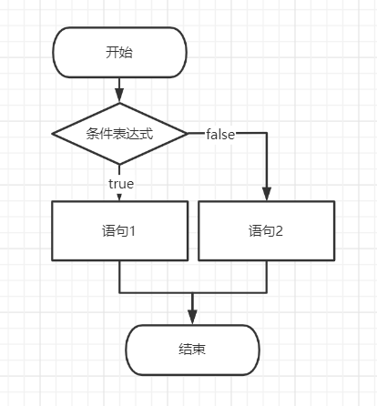
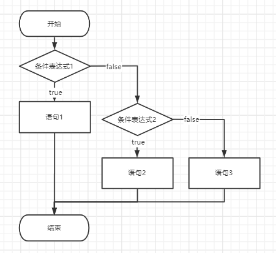

# Day2 选择结构
## 条件表达式
选择结构的基础是条件表达式，条件表达式的运算结构只有两个：真`true`（`1`)，假`false`（`0`)。昨天我们了解了[一些运算符](Day1_顺序结构.md#运算符)，接下来我们来看几个实例。
```c++
int a=123;
int b=321;
char c=76;
a==b //a和b是否相等 false
a!=b //a和b是否不等 true
a>b //a大于b么 false
a!=b && a>c //a和b不相等，同时a还比c大 true(true&&true)
a!=b || a<c //a和b不相等，或者a比c小 true(true||false)
```
## if 条件判断
### 单分支结构

```c++
if(条件表达式){
    //条件表达式为真时执行
}
```
```c++
cin>>a>>b;
if(a==b){
    cout<<"Good"<<endl;
}
/*
输入：123 123
输出：Good
输入：123 321
输出：（无输出）
*/
```
**注意：** 判断两个变量是否相等使用的运算符是`==`而非`=`(赋值操作符)，使用`=`并不会导致编译失败，但会使程序运行发生难以预知的错误。
### 双分支结构

```c++
if(条件表达式){
    //语句1;
}else{
    //语句2;
}
```
以下是一个输出两个数中较大的数的实例
```c++
int a,b;
cin>>a>>b;
if(a>b){
    cout<<a<<endl;
}else{
    cout<<b<<endl;
}
//思考：为什么没有单独考虑a==b的情况？
```
### 多分支结构

```c++
if(条件表达式1){
    //语句1
}else if(条件表达式2){
    //语句2
}else{
    //语句3
}
```
例题:输入两个整数𝑎,𝑏满足1≤𝑎,𝑏≤100，再输入一个字符𝑜𝑝，若字符为运算符之一（ + ,− ,  ∗,  / ），则计算出𝑎 𝑜𝑝 𝑏的值。
- 若𝑜𝑝=′/′且除数为0，则输出“𝐷𝑖𝑣𝑖𝑑𝑒𝑑 𝑏𝑦 𝑧𝑒𝑟𝑜!”。
- 若𝑜𝑝不为运算符之一，则输出“𝐼𝑙𝑙𝑒𝑔𝑎𝑙 𝑖𝑛𝑝𝑢𝑡!”。
```c++
int a,b;
char op;
cin>>a>>b>>op;
if(op=='+'){
    cout<<a+b<<endl;
}else if(op=='-'){
    cout<<a-b<<endl;
}else if(op=='*'){
    cout<<a*b<<endl;
}else if(op=='/'){
    if(b==0){
        cout<<"𝐷𝑖𝑣𝑖𝑑𝑒𝑑 𝑏𝑦 𝑧𝑒𝑟𝑜!"<<endl;
    }else{
        cout<<a/b<<endl;
    }
}else{
    cout<<"𝐼𝑙𝑙𝑒𝑔𝑎𝑙 𝑖𝑛𝑝𝑢𝑡!"<<endl;
}
```
### if语句的简写形式
一般情况下，需要满足某条件才被执行的语句被包裹在`{}`中，形成一个**语句块**并放置在if条件之后。如果`{}`中只有一条语句（简单来说，就是里面只有一个`;`，因为有`;`结尾才一条语句），就可以省去花括号`{}`。
```c++
if(a>b){
    cout<<a<<endl;
}
//可以简写为
if(a>b) cout<<a<<endl;
//----------------------
if(a>b){
    int t=a;
    a=b;
    b=t;
}
//并不能简写成
if(a>b) int t=a;
a=b;
b=t;
//别忘了，分号意味着一句话的结束，此时a=b，b=t已经被排除在了if语句之外
``` 
## switch 条件判断
`switch`便于对于同一表达式或变量存在多种取值的情况进行判断
```c++
switch(表达式){
case 0:    //表达式的各种取值+冒号，这跟我们平常列举各种情况的写法类似
case 1:    //当表达式的多个取值的结果都一样的时，可以写在一起，在最后写break.
case 3:
   cout << "情形1";
    break;
case 2:
    cout <<"情形2";
    break;
case 4:
    cout <<"情形3";
    break;
default:   //以上这些情形都不满足时，执行default中的语句
    break;
}
```
在如上一例题那样的情况下，可以改用`switch`进行判断。
```c++
int a,b;
char op;
cin>>a>>b>>op;
switch(op){
    case '+':
        cout<<a+b<<endl;
        break;
    case '-':
        cout<<a-b<<endl;
        break;
    case '*':
        cout<<a*b<<endl;
        break;
    case '/':
        if(b==0)
            cout<<"𝐷𝑖𝑣𝑖𝑑𝑒𝑑 𝑏𝑦 𝑧𝑒𝑟𝑜!"<<endl;
        else
            cout<<a/b<<endl;
        break;
    default:
        cout<<"𝐼𝑙𝑙𝑒𝑔𝑎𝑙 𝑖𝑛𝑝𝑢𝑡!"<<endl;
        break;
}
```