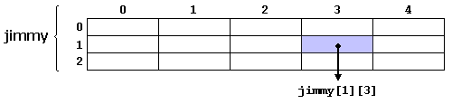

# Day4 数组
## 我们为什么要使用数组
数组是放置在连续内存位置中的一系列相同类型的元素，可以通过向唯一标识符添加索引来单独引用数组。

这意味着，例如，可以将5个int类型的值声明为一个数组（只使用一个标识符(变量名)），而不必声明5个不同的变量（每个变量都有其自己的标识符）。取而代之的是，使用数组将这五个int值存储在连续的内存位置中，并且可以使用具有适当索引的相同标识符访问所有5个int值。

那我们为什么要使用数组？

标识符在循环结构中不能被改变，但索引数值却可以被改变。使用添加索引的方式，就可以使用循环结构来快速访问不同元素了。

例如，包含5个int类型的整数值foo的数组可以表示为：


每个空白格子代表数组的元素。这些是int类型的值。这些元素编号从0到4，第一个为0，最后一个为4；在C++中，无论发生什么，第一个元素的编号都是0（而不是1）。

## 一维数组
```c++
//数据类型 名称[元素数量];
type name[elements];
int foo[5]; //定义一个含有5个元素的int数组，名称（标识符）为foo
int bar[5]={16, 2, 77, 40, 12071}; //定义数组并赋予初始值
int baz[5]={10, 20, 30}; //定义数组并给前3个元素赋予初始值
int qux[5]={}; //定义数组并初始化为空（全0）
int quux[]={16, 2, 77, 40, 12071}; //可以省略数组的元素数量，由编译器自动识别
```
例：输入n个数，倒序输出
```c++
int n;
int a[200];
cin>>n;
for(int i=1;i<=n;i++) cin>>a[i];
for(int i=n;i>=1;i--) cout<<a[i]<<" ";
```
**注意：** 访问数组中的某个元素，需注意下标的大小，防止超出数组定义的范围，发生不可预知的错误或导致程序崩溃。
```c++
int a[5];
a[4]=1;   //正确
a[5]=1;   //错误
a[-1]=1;  //错误
a[6000]=1 //错误
```
## 二维数组
二维数组其实就是数组的数组，如图所示。



相信你也猜出了如何定义二维数组
```c++
int jimmy[3][5];
```

## 再说变量的作用域
在前三天的学习中，你可能已经听说了变量的作用域问题。现在我们就来仔细地学习一下变量的作用域。

一般来说，有三个地方可以声明变量
- 在一个代码块`{}`内部声明的变量，称为局部变量。
- 在所有函数外声明的变量，称为全局变量。
- *在函数的参数表中声明的变量，称为形式参数。（后续会学习到）*

以一个简单的程序为例，来了解一下什么是局部变量，什么是全局变量。
```c++
#include<iostream>
using namespace std;
int T; //全局变量
int main(){
    cin>>T;
    int sum=0; //局部变量
    for(int i=1;i<=T;i++){ // i是局部变量
        sum+=i;
        int temp=i; //temp也是局部变量,定义在这个区域内的都是局部变量
    }
    cout<<sum<<endl;
    return 0;
}
```
局部变量只能被代码块内部的语句使用，全局变量可以在程序的任何地方被使用。
```c++
#include<iostream>
using namespace std;
int T;
int main(){
    cin>>T;
    int sum=0;
    for(int i=1;i<=T;i++){
        sum+=i;
        int temp=i;
    }
    cout<<sum<<endl; //处于变量的作用域内，可以输出
    cout<<T<<endl; //全局变量，可以输出
    cout<<i<<endl; //处于i作用域之外，编译错误
    cout<<temp<<endl; //同理，编译错误
    return 0;
}
```
当全局变量和局部变量的名称重复时，会优先使用局部变量（即全局变量会被覆盖）
```c++
int i=100;
for(int i=1;i<=5;i++){
    cout<<i<<" ";
}
cout<<i<<" ";
//输出：
//1 2 3 4 5 100
```
## 其他一些小东西
### 利用 memset 清空数组
如果我们想清空一个数组，可以使用头文件`cstring`中的memset函数
```c++
#include<cstring>
using namespace std;
int main(){
    int a[50];
    memset(a,0,sizeof(a));
    return 0;
}
```
**注意：**
- memset与内存操作有关，只能用于将数组的值设置为0（暂时这么认为），设置为其他数值会导致意料之外的问题
- 忘记`#include<cstring>`并不会在windows平台上引发编译错误，但在评测用的linux环境中会导致编译错误（血与泪的教训）
### 算法的时间复杂度
计算机的计算能力是有限的，每秒大约可以计算10<sup>8</sup>次，我们可以使用算法复杂度来衡量一个程序所进行的操作数，进而推断出程序的运行时间。

一个算法花费的时间与算法中语句的执行次数成正比例，哪个算法中语句执行次数多，它花费时间就多。简化的来说，我们可以用程序中进行循环的次数表示算法的时间复杂度。用O(表达式)表示。

例如
```c++
//O(n)
for(int i=0;i<n;i++){
    cout<<i<<endl;
}
//我们通常忽略复杂度中的常数部分
//例如下面程序的复杂度是O(n^2)而不是O(n(n+1)/2)
for(int i=0;i<n;i++){
    for(int j=0;j<i;j++){
        cout<<i<<endl;
    }
}
//O(mn)
for(int i=0;i<n;i++){
    for(int j=0;j<m;j++){
        cout<<i<<endl;
    }
}
```
