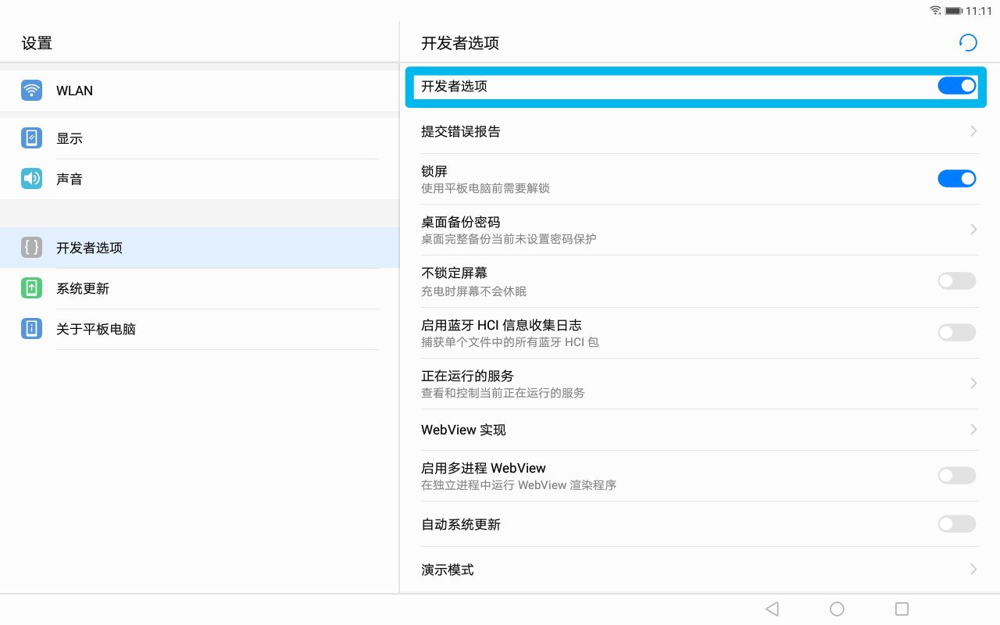
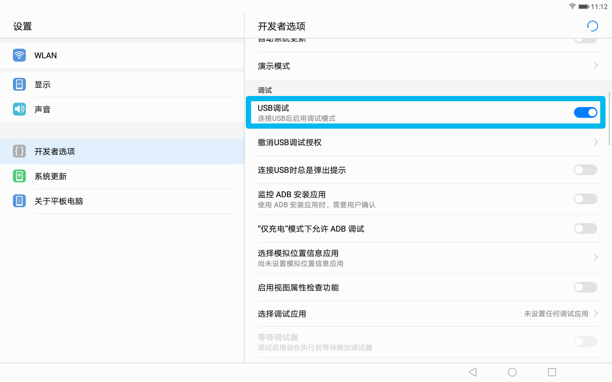
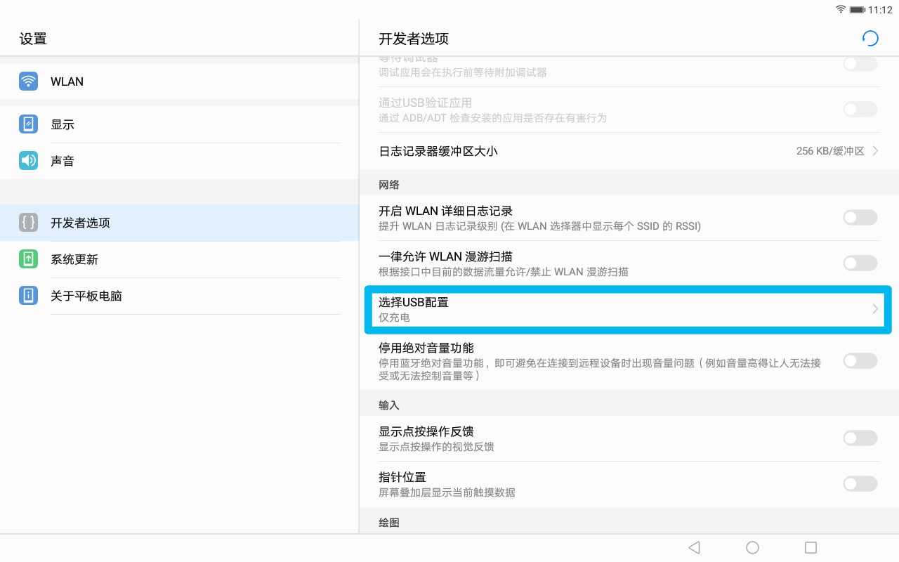
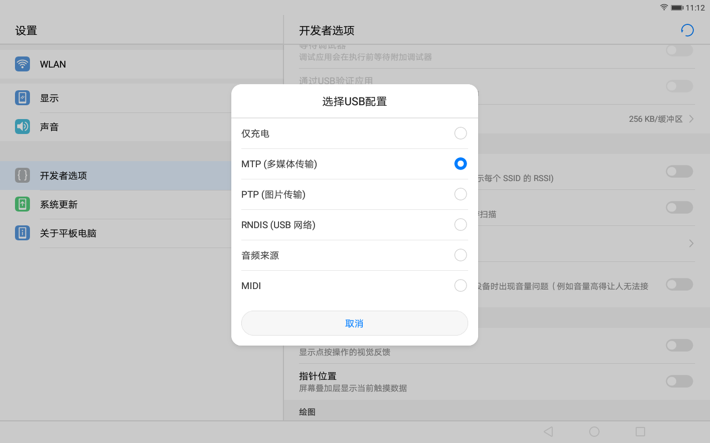

# 省实验平板完全使用指南

### 一周目：启用开发者模式并与平板通信

打开设置，在`关于平板电脑`中轻击10次版本号，以启用开发者模式


在`开发者选项`中，保证开发者选项处于开启状态



开启`USB调试`



在`选择USB配置`中，将USB配置改为MTP多媒体传输模式





如果误触导致平板异常，你可以通过右上角的按钮还原至原始设置，或关闭开发者模式防止误触

使用充电数据线连接平板与电脑，即可对平板的部分数据进行更改


### 二周目：图片的导入与导出

> 本功能需在开发者模式下连接平板与电脑方可使用

通过以下路径打开的文件夹储存了你的截屏，你可以导入，导出，删除

```
此电脑\华为平板 C3 BZA\内部存储\Pictures\Screenshots
```

通过以下路径打开的文件夹储存了你拍摄的照片，你可以导入，导出，删除

```
此电脑\华为平板 C3 BZA\内部存储\DCIM\Camera
```

通过以下路径打开的文件夹储存了通过无线宝app文档共享功能上课时产生的文档快照缓存，你可以导入，导出，删除

```
此电脑\华为平板 C3 BZA\内部存储\Vizpower\bkimg
```

通过以下路径打开的文件储存了无线宝app的用户头像，你可以更换

```
此电脑\华为平板 C3 BZA\内部存储\Vizpower\ClassListImage\default_tea_head_logo.png
```

通过以下路径打开的文件夹储存了默认壁纸，不建议更换，建议使用平板操作

```
此电脑\华为平板 C3 BZA\内部存储\HWThemes\.cache\Glaze.hwt\wallpaper
此电脑\华为平板 C3 BZA\内部存储\HWThemes\.cache\Light.hwt\wallpaper
```


