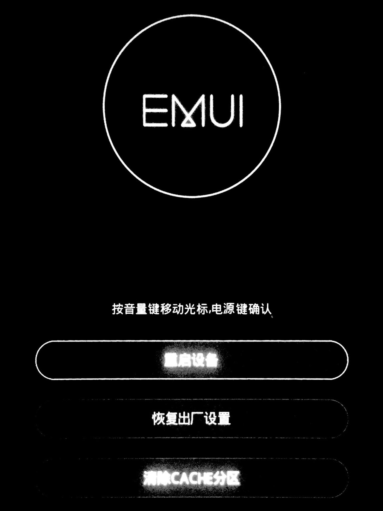

# 省实验平板完全使用指南

### 一周目：开发者模式

打开设置，在`关于平板电脑`中轻击10次版本号，以启用开发者模式


在`开发者选项`中，保证开发者选项处于开启状态


开启`USB调试`


在`选择USB配置`中，将USB配置改为MTP多媒体传输模式


如果误触导致平板异常，你可以通过右上角的按钮还原至原始设置，或关闭开发者模式防止误触

使用充电数据线连接平板与电脑，即可对平板的部分数据进行更改


关闭开发者选项需要清除设置app缓存，此功能处于关闭状态，三周目提供了另一种关闭开发者选项的可能方法

### 二周目：图片的导入与导出

> 本功能需在开发者模式下连接平板与电脑方可使用

通过以下路径打开的文件夹储存了你的截屏，你可以导入，导出，删除

```
此电脑\华为平板 C3 BZA\内部存储\Pictures\Screenshots
```

通过以下路径打开的文件夹储存了你拍摄的照片，你可以导入，导出，删除

```
此电脑\华为平板 C3 BZA\内部存储\DCIM\Camera
```

通过以下路径打开的文件夹储存了通过无线宝app文档共享功能上课时产生的文档快照缓存，你可以导出

```
此电脑\华为平板 C3 BZA\内部存储\Vizpower\bkimg
```

通过以下路径打开的文件储存了无线宝app的用户头像，你可以更换

```
此电脑\华为平板 C3 BZA\内部存储\Vizpower\ClassListImage\default_tea_head_logo.png
```

通过以下路径打开的文件夹储存了默认壁纸，不建议更换，建议使用平板操作

```
此电脑\华为平板 C3 BZA\内部存储\HWThemes\.cache\Glaze.hwt\wallpaper
此电脑\华为平板 C3 BZA\内部存储\HWThemes\.cache\Light.hwt\wallpaper
```

### 三周目：工程模式

在正在开机的状态下同时按住`音量+`和`电源键`即可进入经过华为EMUI改动后的工程模式，如图所示，你可以按`音量键`移动光标，`电源键`确认



该模式下有三个选项，以下是其名称与作用

|     名称      |                             作用                             |
| :-----------: | :----------------------------------------------------------: |
|   重启设备    |                          退出该模式                          |
| 恢复出厂设置  |                  刷机，切勿选择，三年后再用                  |
| 清除CACHE分区 | 清除缓存，可能会产生退出开发者模式的效果，鉴于该系统运行模式未知，作者尚未尝试 |
