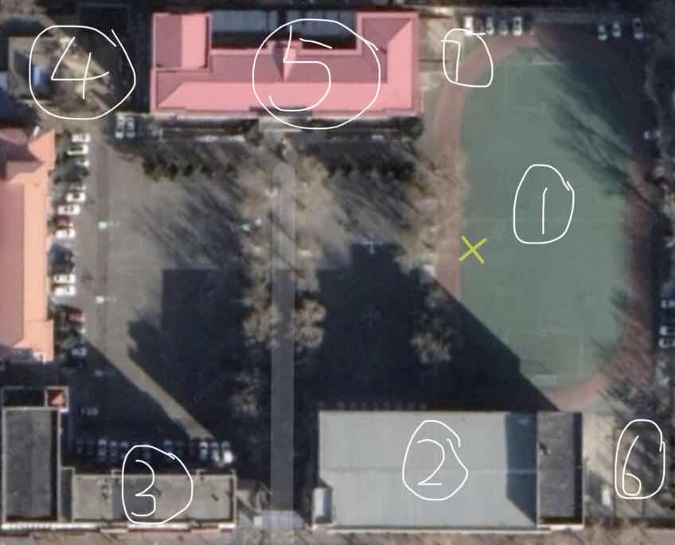

# 高中日记

## 目录

- [Day1 报到](#day1)
- [Day2 大扫除](#day2)
- [Day3 ？](#day3)

------

## Day1

> 报到

​		时间似水，绵绵流淌。我乘一只无帆无浆的船漂在时间的长河中，后方的景色逐渐远去，变小，变模糊，最终消失在记忆的天际线。我想抓住一些不愿分别的过往，我想回到那个分岔口，我想……无奈，一切只是徒劳，在这条河中我是这样的无力。好在前方风光依旧旖旎，景色更加美丽。许多臆想中的事物显露出轮廓，逐渐袭来，变大，变清晰，最终展现在眼前。就像省实验中学这几个字，从志愿填报单上跳出来，以牌匾的形式横在林荫小路的起点。我满心欢喜地踏上这条路，这条充满了未知与挑战的高中之路。

​		找一个空位坐下，小心翼翼地与同桌确定是否走对了班级。“这是刘老师班吧？” 同桌答：“一会看发型就行了”。待刘老师步入，自然惊叹道：好一个地中海！刘老师立于讲台，涛涛不绝，一句气场定住众人，二句威信立于教室，三句便令人肃然起敬。“ ‘相’ 发一声意为交互，互相，希望这三年我们是双相思，不是单相思”。辨“霄”与“宵”，识“柏”在不同情况下的发音，穿夹在话语中的语文知识无时无刻不在提醒我：我们的班主任是位语文老师。

​		同学们的自我介绍五花八门，有人将眼镜甩了出去，有人大笔一挥在黑板上留下了自己的微信号。围绕自己的名字，同学们纷纷做出了解读，更有人甚至对老师的名字做出了解读：大江载大船。老师解释道：是家谱轮到了个“传”。我想起了德云社的云鹤九霄龙腾四海，忽然想按照老师的指引回家好好研究以下家谱，庆字是个什么来历。老师很善于从细微之处引起我们的兴趣，他提了一个“中央政治局常委为什么是七个人”。我对这方面很感兴趣，对这个问题却从来没想过，事后问百度，百度也没有给出一个让人满意的答案。

​		小半天转瞬即逝，刘传江老师人设分明，知识渊博，风趣幽默，在心中留下了不可磨灭的印象。同学的名字却只是记住了王子硕，刘芳硕。第二天的大扫除定会更加有趣。

------

## Day2

> 大扫除

​		没怎么做过家务，听闻老师让带刷地的刷子后，我心中充满了疑惑。清理纸屑的笤帚，刷洗污垢的拖布，可以沾了水在黑板上写大字的抹布，都在我心中留下了深刻的印象，却唯独这刷子，只是常在烤冷面的地摊上见过。用一排横着的刷毛蘸取红彤彤的辣酱，均匀地抹在弹簧般的面饼上，像是在故宫刷墙的粉刷匠，只是散出的不是油漆味，而是诱人的香。于是，照着烤冷面的尺寸，我拿了一把刷子，开始了一天的大扫除。

​		洗衣粉洒在水里，沉向水底，用手轻轻搅拌，白色的颗粒顺着水流翩翩舞动，若双手同时搅拌，激起的水花则可以轻松灌进手套，只稍一个小时，手便像泡椒风爪一样褶皱白嫩。如果澄清的水变得白浑，而后近似乳白，便可以开刷了。一众同学躲在墙角，手拿大小各式的刷子，虎视眈眈地盯着这桶乳白色的液体，弯弓上的箭一般。哗啦，一桶水倾泻而下，同学们蜂拥而上。我的小刷子也并非无用武之地，边边角角细微之处三下五除二便能光亮如初。最后满地都是泡沫，便换笤帚搓子，把水扫入桶中。在熙熙攘攘的热闹之地男厕所换完一桶水后，再用拖把拖一遍，就可以铺上报纸吸去附在地板上的水，圆满收工了。这样粗犷的“洗地”方法我着实闻所未闻见所未见，但是行之有效，行之迅速，实在是开了眼界。这场大扫除我就像刘姥姥进大观园，只能挑些只费力气不用技巧的活干，不过get到使用刷子这一新技能后，下次就能轻车熟路了吧。

​		取书发书之类不算新鲜活，干完这些竟还有一堂体活的时间。结合卫星地图，请同我一起逛逛这个麻雀虽小五脏俱全的校园。

1. 这是个比我们年龄还大的塑胶跑道，据老师说，他刚到这里工作时它就在这里了。工程质量是真的牛。

2. 开放的楼层有四层。第一层与第二层是一个富丽堂皇的大食堂，置身于食堂，会感觉自己并非在一所学校，而是一个具有后现代主义建筑风格的快餐店。（仔细观察会发现一楼其实是”入土三分“的）第三层和第四层是一个巨大的篮球馆，右侧的舞台告诉我们它还具备办室内活动的功能。

3. 竖着的是我们的图书馆，横着的是别人的居民楼，校长使用他伟大的神力搞定了海城小学，何不把这个居民楼也搞下来？建个泳池也好夏天游泳冬天滑冰 :)

4. 菜园。是的你没听错菜园。还有两只可爱的小兔叽。

5. 教学楼，五层，没电梯（其实有电梯也用不了，比如高三校区）

6. 海航训练场所，可惜我们不能进去van。

7. 隆重介绍，小卖部，价格公道，刷饭卡即可。学校里居然有小卖部是我万万没想到的。门口的遮阳棚是由葡萄藤组成的，真怕晚上买点吃的被蚊子叮一身包233。

希望传说中连接高一校区和高二校区的天桥能早日建成。真的迫不及待开学了呢。